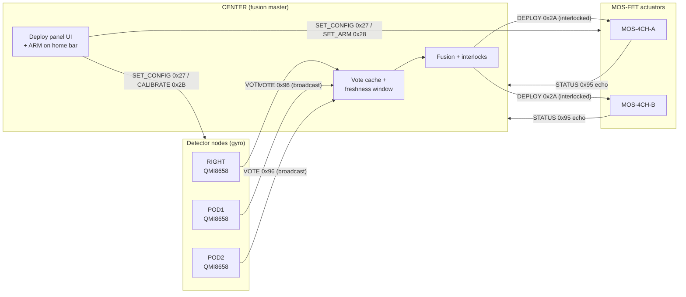

<!-- Licensed under Sovereign Individual License v1.0 — see LICENSE file -->
# Safety Deployment System (Rollover Parachute)

> **STATUS: GO.** Code-complete, built clean for all targets, flashed and
> tag-verified on `center`, `right`, `pod1`, `pod2`. Autonomous rollover
> auto-deploy is opt-in (`AUTO_DETECT`, default OFF); manual deploy is always
> available.

The deployment system fires a rollover-recovery parachute (or any one-shot
pyro/solenoid charge) on a race car. It is **distributed** and **interlocked**:
multiple gyro-equipped nodes independently detect a rollover and vote; the
Center display fuses those votes and, only when every safety interlock agrees,
energizes the deploy charge through a MOS-FET power channel.

There is **no single point that can fire by accident** — firing requires a
unanimous sensor quorum (or a deliberate operator action) *and* an armed,
enabled, channelled, online actuator.

---

## 1. Safety Philosophy

| Principle | Implementation |
|-----------|----------------|
| Default safe | Fresh MOS boots **disabled**, **no channels**, **disarmed**. `AUTO_DETECT` defaults OFF. |
| No accidental fire | Autonomous deploy needs a **unanimous** 3-detector quorum; manual touch deploy is **long-press only**. |
| ARM never persists | A reboot (center or MOS) always comes up **DISARMED**. ARM is a live, non-persisted intent. |
| Defence in depth | Center pre-checks interlocks before sending DEPLOY; the MOS re-checks its own interlock before energizing. |
| Fail-silent sensors | A detector that goes silent (crash, power loss) simply stops voting; its stale vote **expires** and drops from the quorum — it cannot force a fire. |
| Independent of mesh quirks | Votes are **broadcast**, so the safety signal does not depend on which center MAC a node has learned. |
| Operator override | A physical manual-release button on any detector fires immediately (still interlocked by armed + enabled + online). |

---

## 2. Node Topology & Roles

| Node | Role | Hardware | IMU | Function |
|------|------|----------|-----|----------|
| `center` | **Fusion master** | ESP32-S3 4.3" 800×480 | — | Tallies votes, runs interlocks, sends DEPLOY, owns the UI |
| `right` | **Detector** | ESP32-S3 LCD-2.8C round | QMI8658 | Local roll detect + vote |
| `pod1` | **Detector** | ESP32-S3 AMOLED-1.75 | QMI8658 | Local roll detect + vote |
| `pod2` | **Detector** | ESP32-S3 AMOLED-1.75 | QMI8658 | Local roll detect + vote |
| `mos-4ch-a` | **Actuator** | ESP32 MOS-FET 4-CH | — | Energizes deploy channel(s) when fired |
| `mos-4ch-b` | **Actuator** | ESP32 MOS-FET 4-CH | — | Second/redundant actuator |

The **actuator is a MOS power channel**, not a dedicated GPIO. `channel_mask`
(bits 0–3 = CH1–CH4) selects which of the MOS's four power channels energize on
deploy. The legacy single-GPIO actuator path is inhibited (`gpio_num = -1`).

> The detector set is fixed in `OPENDASH_ROLLOVER_DETECTORS` =
> `{ RIGHT, POD1, POD2 }`, quorum count `OPENDASH_ROLLOVER_DETECTOR_COUNT = 3`.
> `LEFT` and `GPS` are intentionally excluded (no IMU / already heavily tasked).

---

## 3. Data Flow



---

## 4. Detector Node Logic

Each detector links the shared module
[`common/src/opendash_rollover_detector.c`](../common/src/opendash_rollover_detector.c).
The node supplies a tiny read callback (its IMU → roll angle + roll rate); the
module owns the entire state machine.

### Evaluation (≈100 Hz)

1. **Apply zero/cal offset** — `roll = raw_roll − s_roll_offset` so a non-level
   mount reads ~0° at rest (see §8).
2. **Sustained-angle trip** — `|roll| ≥ roll_deploy_deg` held for `sustain_ms`.
3. **Hysteresis** — once tripped, only clears below
   `roll_deploy_deg − TILT_HYSTERESIS_DEG` (5°). Stops chatter at the threshold.
4. **Fast tip-over** — `|roll_rate| ≥ roll_rate_deg_s` fires immediately,
   bypassing `sustain_ms`.
5. **Enable gate** — nothing trips while `cfg.enabled == 0`.
6. **Manual button** — a staged GPIO held continuously for
   `BTN_HOLD_MS` (750 ms) raises a hard `manual` override.

### Vote airtime

| State | Behaviour |
|-------|-----------|
| Upright/idle | **Silent** — zero airtime when the car is level. |
| State change | Broadcasts one VOTE immediately (rolling 0↔1, manual 0↔1). |
| Active roll/manual | Re-broadcasts every `VOTE_REFRESH_MS` (150 ms) so the center's freshness window never lapses mid-event. |
| Stops rolling | Sends one `rolling=0` vote, then goes silent (cached as not-rolling). |
| Crashes mid-roll | Last `rolling=1` vote **expires after 600 ms** → drops from quorum (no false deploy). |

Thresholds (`roll_deploy_deg`, `sustain_ms`, `roll_rate_deg_s`, `enabled`) are
**pulled live** from the center-pushed config — tuning is done from the Center
deploy panel with **no reflash**.

---

## 5. Vote Protocol

Detectors **broadcast** `OPENDASH_CMD_PARACHUTE_VOTE (0x96)` carrying
`opendash_parachute_vote_t`:

```c
typedef struct __attribute__((packed)) {
    uint8_t  node;        // opendash_node_t source (self-identifies sender)
    uint8_t  rolling;     // 1 = local roll-detect active, 0 = clear
    uint8_t  manual;      // 1 = physical manual-release button held
    uint8_t  reason;      // opendash_parachute_reason_t
    float    roll_deg;    // live |roll| at vote time (post-calibration)
    float    roll_rate;   // live roll rate (deg/s)
    uint32_t seq;         // monotonic counter (debug / dedupe)
} opendash_parachute_vote_t;
```

**Why broadcast?** A unicast vote would depend on the detector having correctly
learned the center's MAC. Broadcasting makes the life-safety signal immune to
the mesh "first bit7-clear frame" center-latch hazard.

---

## 6. Center Fusion & Interlocks

The fusion reconciler `rollover_fusion_eval()` runs inside the Center control
task, internally rate-limited to `FUSE_PERIOD_MS` (100 ms).

### Tally (`rollover_tally`)

* A cached vote older than `VOTE_EXPIRY_MS` (600 ms) is treated as **no vote**.
* `rolling` = count of detectors with a fresh `rolling=1` vote.
* `manual` = true if **any** detector holds a fresh `manual=1` vote.

### Trigger

```
trigger = manual  OR  (rolling >= DETECTOR_COUNT)      // unanimous 3, or any 1 manual
```

### Per-MOS interlock chain (ALL must pass)

For each MOS (A and B), an autonomous deploy fires only when **every** gate
agrees:

| # | Gate | Source |
|---|------|--------|
| 1 | `trigger` true | vote tally |
| 2 | not already latched this event | per-MOS `s_auto_latched[]` |
| 3 | MOS **online** | node heartbeat |
| 4 | MOS status echo valid | cached `0x95` |
| 5 | MOS **ARMED** | live arm state |
| 6 | config **enabled** | persisted cfg |
| 7 | **AUTO_DETECT** flag set | persisted cfg (opt-in) |
| 8 | `channel_mask != 0` | persisted cfg |

On pass: `DEPLOY (0x2A)` + `PULL_ALL (0x29)` are force-sent, and a **per-MOS
latch** is set so it fires once per event. When `trigger` clears, the latch
resets. The Center logs `AUTO-DEPLOY <mos>: ROLLOVER QUORUM|MANUAL RELEASE`.

> The unanimous-3 quorum means **one silent or dissenting detector blocks
> autonomous fire**. The single-manual-vote path exists for a deliberate
> operator pull and is still gated by interlocks 3–8.

---

## 7. Configuration Model

The **MOS owns** the authoritative deploy config and persists it to NVS. Center
pushes updates and confirms via a status echo. The same config is **mirrored to
the detectors** so their local detection uses the operator's thresholds.

`opendash_parachute_config_t` (packed wire + NVS blob, version 1):

| Field | Meaning | Default (fresh MOS) |
|-------|---------|---------------------|
| `version` | config schema version | `1` |
| `enabled` | system active on this MOS | `0` (off) |
| `channel_mask` | bits 0–3 = CH1–CH4 fired on deploy | `0x00` (none) |
| `flags` | bit0 = `FIRE_PULSE` (else latch), bit1 = `AUTO_DETECT` | `0` |
| `min_speed_mph` | deploy speed gate | `150` |
| `roll_deploy_deg` | sustained roll deploy angle | `45` |
| `roll_rate_deg_s` | fast tip-over rate | `300` |
| `sustain_ms` | hold time past the angle | `200` |
| `pulse_ms` | energize duration (pulse mode) | `500` |

Confirmation is authoritative: the Center compares the MOS's echoed `cfg`
(packed → `memcmp`) against the exact pushed snapshot. The reconciler re-sends
~1 Hz until confirmed — there is **no give-up** and the UI never tells the user
to "press again."

---

## 8. Zero / Calibrate

A non-level mount would otherwise read a constant false tilt. **ZERO/CAL**
captures each detector's current resting roll as a baseline offset.

* Opcode `OPENDASH_CMD_PARACHUTE_CALIBRATE (0x2B)`, M→S, no payload.
* The detector snapshots its live raw roll into `s_roll_offset` and
  **NVS-persists** it (namespace `rollover`, key `roll_off`), so the offset
  survives reboot. Detection thereafter measures roll **relative** to this
  baseline.
* On calibrate, the detector clears in-progress roll state and broadcasts a
  fresh *level* vote — so the Center's `ROLL VOTES x/3` indicator immediately
  drops to 0 as confirmation.
* **Press it with the car sitting level/normal** (on its wheels on flat
  ground). Do **not** calibrate while tilted — that would zero out real tilt.
* The Center **ZERO/CAL** button (deploy panel, below REFRESH) broadcasts the
  command to all three detectors at once.

Calibration affects only the roll **angle** baseline; the roll-rate (gyro)
threshold is unaffected. Manual deploy is unaffected by calibration.

---

## 9. ARM Model

ARM is a **latched intent**, reconciled to every online MOS exactly like config:

* Reachable from the persistent **home status bar** (any screen).
* **Arming requires a deliberate long-press** (~1 s); a short tap disarms.
* **Disarm always wins instantly** and is re-sent until every MOS echoes safe.
* Intent defaults SAFE and is **never persisted** — center reboot comes up
  DISARMED, and each MOS independently boots DISARMED.
* `OPENDASH_CMD_PARACHUTE_SET_ARM (0x28)`, payload `[armed:1]`.

---

## 10. Center Deploy Panel (UI)

Config → **DEPLOYMENT SYSTEM**. Controls:

| Control | Action |
|---------|--------|
| **MOS-A / MOS-B** | Select the target actuator to configure. |
| **ENABLE** | Toggle the system on this MOS. |
| **CH1–CH4** | Pick which power channel(s) fire on deploy (`channel_mask`). |
| **FIRE: LATCH/PULSE** | Latch the channel on, or pulse it for `pulse_ms`. |
| **AUTO: ON/OFF** | `AUTO_DETECT` opt-in — enables autonomous quorum fire. Default OFF. |
| **MIN SPEED / ROLL ANGLE / ROLL RATE / SUSTAIN / PULSE** | Numeric tunables (keypad). |
| **PUSH CONFIG** | Commit + reconcile config to the MOS *and* mirror to detectors. |
| **REFRESH** | Re-load the MOS's persisted config. |
| **ZERO/CAL** | Zero all detectors to the current resting angle (§8). |
| **HOLD TO DEPLOY** | Manual long-press fire (always available, see §11). |

A live status row shows `ROLL VOTES x/3`, `[MANUAL]`, and the `[AUTO ON/auto
off]` state plus the MOS's live ARMED/DEPLOYED echo.

---

## 11. Manual Deploy Path

The on-screen **HOLD TO DEPLOY** button is the top-priority operator fire and is
**always available**, independent of the `AUTO_DETECT` flag. Before sending, the
Center verifies the target MOS is **online**, **armed**, **enabled**, and has a
**channel selected**; the MOS re-checks its own interlock before energizing.

The physical manual-release button on a detector (staged GPIO, default disabled)
produces a `manual` vote that the Center treats like the on-screen deploy.

---

## 12. Opcode Reference

| Opcode | Dir | Payload | Purpose |
|--------|-----|---------|---------|
| `0x27 PARACHUTE_SET_CONFIG` | Center → MOS/Detector | `opendash_parachute_config_t` | Push + persist config |
| `0x28 PARACHUTE_SET_ARM` | Center → MOS | `[armed:1]` | Arm / disarm (not persisted) |
| `0x29 PARACHUTE_PULL_ALL` | Center → MOS/Detector | — | Request a STATUS echo |
| `0x2A PARACHUTE_DEPLOY` | Center → MOS | — | Interlocked fire request |
| `0x2B PARACHUTE_CALIBRATE` | Center → Detector | — | Zero/cal roll to resting angle |
| `0x95 PARACHUTE_STATUS` | MOS/Detector → Center | `opendash_parachute_status_t` | Config + actuator-state echo |
| `0x96 PARACHUTE_VOTE` | Detector → Center (broadcast) | `opendash_parachute_vote_t` | Rollover vote |

---

## 13. Distributed-Detection Tunables

From [`common/include/opendash_rollover.h`](../common/include/opendash_rollover.h):

| Constant | Default | Role |
|----------|---------|------|
| `OPENDASH_ROLLOVER_DETECTORS` | `{RIGHT, POD1, POD2}` | Voter set |
| `OPENDASH_ROLLOVER_DETECTOR_COUNT` | `3` | Unanimous quorum size |
| `OPENDASH_ROLLOVER_VOTE_EXPIRY_MS` | `600` | A vote older than this = no vote |
| `OPENDASH_ROLLOVER_FUSE_PERIOD_MS` | `100` | Center fusion tick |
| `OPENDASH_ROLLOVER_VOTE_REFRESH_MS` | `150` | Detector re-broadcast while active |
| `OPENDASH_ROLLOVER_EVAL_PERIOD_MS` | `10` | Detector eval rate (100 Hz) |
| `OPENDASH_ROLLOVER_BTN_GPIO_*` | `-1` | Per-node manual-release GPIO (disabled) |
| `OPENDASH_ROLLOVER_BTN_ACTIVE_LEVEL` | `0` | Button active-low |
| `OPENDASH_ROLLOVER_BTN_HOLD_MS` | `750` | Manual-button anti-bump hold |

Threshold defaults live in
[`common/include/opendash_parachute.h`](../common/include/opendash_parachute.h)
(see §7).

---

## 14. Flashing & Node Identity

All four firmwares are flashed with the tag-verified safe wrapper, which refuses
to flash unless the device's stable `by-id` serial *and* its running-firmware
log tag both match the requested node:

```bash
source <esp-idf>/export.sh
python scripts/od-flash.py center --no-monitor
python scripts/od-flash.py right  --no-monitor
python scripts/od-flash.py pod1   --no-monitor
python scripts/od-flash.py pod2   --no-monitor
```

| Node | by-id serial substring | Tag |
|------|------------------------|-----|
| center | `1a86_USB_Single_Serial_58FA100070` | `opendash_center` |
| right | `1a86_USB_Single_Serial_5AE7114735` | `opendash_right` |
| pod1 | `Espressif_USB_JTAG…1C:DB:D4:7B:5F:88` | `opendash_pod1` |
| pod2 | `Espressif_USB_JTAG…1C:DB:D4:7B:61:68` | `opendash_pod2` |

> The MOS actuators share a single FTDI FT232R (`/dev/ttyUSB1`) — flash one at a
> time; the tag probe disambiguates which board is attached.

---

## 15. Operating Procedure (pre-race)

1. **Mount level** — car on its wheels, flat ground.
2. **Config** → DEPLOYMENT SYSTEM → select **MOS-A** (and **MOS-B** if used).
3. **ENABLE** the system, choose **deploy channel(s)**, set **FIRE mode** and
   thresholds.
4. **PUSH CONFIG** — wait for the `✓ CONFIRMED` echo.
5. **ZERO/CAL** — zero the detectors to the resting angle; confirm
   `ROLL VOTES 0/3`.
6. (Autonomous only) toggle **AUTO: ON** and PUSH again.
7. **ARM** from the home status bar (long-press) just before the run.
8. Confirm the live row shows **ARMED** and `AUTO ON` (if used).
9. **DISARM** after the run (or it auto-disarms on any reboot).

---

## 16. Failure-Mode Summary

| Failure | System response |
|---------|-----------------|
| One detector loses power mid-run | Its votes expire (600 ms) → quorum can't reach 3 → no autonomous fire. Manual deploy still available. |
| Detector IMU absent (e.g. RIGHT) | Detector init soft-fails; that node runs its display normally and simply never votes. |
| Center reboot | Comes up DISARMED; MOS also boots DISARMED. Operator must re-ARM. |
| MOS offline at trigger | Interlock gate 3 blocks; the other MOS still evaluates independently. |
| Vibration / rough surface | Hysteresis + `sustain_ms` + per-node enable gate suppress chatter; rate path needs a genuine fast tip. |
| Wrong firmware to wrong board | `od-flash.py` dual-checks serial + log tag and refuses without `--force`. |

---

## 17. Source Map

| Concern | File |
|---------|------|
| Thresholds, structs, actuator + config API | [`common/include/opendash_parachute.h`](../common/include/opendash_parachute.h) |
| Distributed-detection tunables + detector API | [`common/include/opendash_rollover.h`](../common/include/opendash_rollover.h) |
| Shared detector state machine + zero/cal | [`common/src/opendash_rollover_detector.c`](../common/src/opendash_rollover_detector.c) |
| Opcodes | [`common/include/opendash_i2c_protocol.h`](../common/include/opendash_i2c_protocol.h) |
| Center vote cache, fusion, senders | [`center/main/espnow_master.c`](../center/main/espnow_master.c) |
| Center deploy panel + ARM bar + ZERO/CAL | [`center/main/ui_manager.c`](../center/main/ui_manager.c) |
| Detector wiring (config/pull/calibrate dispatch) | `right/main/main.c`, `pod1/main/main.c`, `pod2/main/main.c` |
| MOS actuator (energize channels, interlock) | `mos-4ch-a/main/main.c`, `mos-4ch-b/main/main.c` |
| Safe-flash wrapper | [`scripts/od-flash.py`](../scripts/od-flash.py) |
